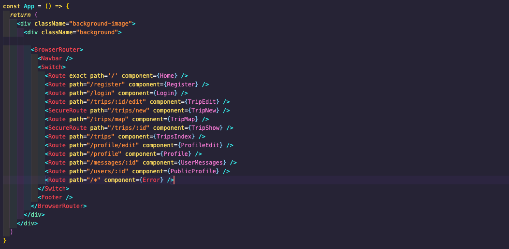

# General Assembly Project 3: Roadtrippers

### Overview
Roadtrippers - a road trip planning social media application. Created the full-stack application in 8 days as a group project with two other people using a React front-end and MongoDB back-end.

### Brief
* Build a full-stack application by making your own backend and your own front-end
* Use an Express API to serve your data from a Mongo database
* Consume your API with a separate front-end built with React
* Be a complete product which most likely means multiple relationships and CRUD functionality for at least a couple of models
* Implement thoughtful user stories/wireframes
* Have a visually impressive design
* Be deployed online so it's publicly accessible.

### Timescale
8 days

### Team Mates
Assia Deramchi (https://github.com/A-Der)
Krissy Little (https://github.com/KL-dotcom)

### Technologies
- React.js
- Node.js
- MongoDB
- Mongoose
- JavaScript(ES6) / HTML5
- SCSS
- Express.js
- Yarn package manager
- Axios
- Json Web Tokens
- Git
- GitHub
- Heroku

### Deployment
The application is deployed on Heroku and can be found at http://road-trippers.herokuapp.com/

### Approach
The main focus of the group was to have impressive user experience and design and to that end, we spent enough time on the design, wireframes and color scheme to ensure that we were all happy. We then agreed the structure for the two back-end models and got started. We divided the team so that Krissy and Assia focused on the back-end and I on the front-end to get the wireframes for each page built in React and then set about adding in the data requests to the back-end, adjusting the back-end models where necessary to ensure we had the right data coming through to the front-end.

### The Build
After a productive idea generation discussion, and having agreed on the concept, we began planning the build, beginning with the back-end. We discussed what information should be attached to the userSchema and tripSchema, as well as other schemas for comments, authorisation and recommendations. My two team mates then focused on implementing what we had discussed while I moved to focus on building out the front-end, ready to receive the information from the back-end. The Trip and User schemas used can be seen below.

For the front-end build, I began by setting up the pages and getting the React Router working effectively with the pages linking correctly. This was then further developed to include the secure route for pages behind the log in barrier. The router code can be seen below.

The first page which was developed further was the trip index page, as it serves as the center point for the trips side of the app. This was set up through DOM manipulation to iterate through the trips returned by the Axios request and create a trip card for each. Search and filtering functionality was added later by my team mate.

Once the trip index page was working, I focused on writing the code to create new trips and to edit trips, which was structured to use the same form but with different headings and content passed in (for example when editing a trip, it was necessary to see the information already in place). For creating a trip, rather than having the whole lengthy form to fill in, we chose to use a shorter form which then on completion takes you to a longer form to include more information. The big challenge was getting the code to work for the map to show up, which is only sent once all the location data has been put in state to ensure that a complete interactive map was returned. I was also able to reuse the code my team mate had written to get the icons related to the features of the trip included on the trip creation page.

With the new trip and trip edit pages completed, I was able to change my focus to finishing up the styling to make it consistent across all pages.

### User Experience
Our goal was to create a trip planning application which gives users the ability to register, create, update and delete trips, as well as have a public profile page. To improve the user experience, we spent time wireframing and discussing the user stories and to made sure that each link was placed where users would expect them to be. We also added the navbar using a burger, the links on which change depending on whether you have logged in.

For the styling, we chose to not use a framework but went for a bold, strong colour palette which we felt suited the concept of Roadtrippers and kept the main structure off centre to add visual edge to the site.

We made Roadtrippers very feature heavy and employed an "MVP plus features" development model. This meant we were able to quickly reach MVP stage and then worked on adding the key functionality which we wanted in the application.

On the landing page, we wanted to keep the styling and functionality simple to welcome the user into the application, so by clicking enter the user is taken to the trip index page so they can see some information without having to log in.

On the trip index page, to keep the focus on the photographs of the trip itself. This is something we felt was lacking on similar websites which felt cluttered with many words when a picture is a much more visually exciting. On hovering over a picture, the user is given the top level information about the trip.

As there is information about trip creator on the trip show page, we elected to put this behind the log in page, so if not logged in, clicking on a trip takes the user to the log in page. 

Once the user is logged in they can then see the detailed information on the trip, such as the banner photo, key features of the trip

Further down the trip show page, there is a map of the trip, key information on the trip, recommendations from other users and a link to the profile of the creator of the trip.

 

This link takes the user to the public profile page of the creator of the trip, which includes their profile picture and a cover photo.

 

Also included on the profile page is other information about the user, such as their interests, dream trip and whats in their garage. 

 

Finally on the profile page is the messaging facility which allows users to message each other and the page shows all current conversations

 

### Bugs and Challenges
The only bug stems from my greatest challenge on this project - inputing trip points on to the map. While it works, it could be slicker and took a good deal longer than it should've done. To achieve a static map was relatively simple, but to get it so that the map was interactive required more precise inputs.

### Wins
For me, the biggest win of the project was the effective team work which, from idea generation through to final delivery, was characterised by positive and open communication. Challenges were overcome by either group discussion or pair coding and the team worked collaboratively to deliver a feature rich final project.

### Key Learnings and Takeaways
Planning and communication - putting in to practice what I'd taken away from Project 2 (Movie Rater) was a game changer. Every morning we would discuss what we were going to work on, whether anyone had any blockers and wanted to pair code or discuss, how we were doing against the plan and how we were doing for features against the deadline. That level of planning, along with a solid plan on what code to write and when, meant we had plenty of time at the end of the project to test and add seeds.

### Future Content
To further develop Roadtrippers, the first thing would be the trip input functionality. While it currently works, it would be better to have a drop down or selector for the country and, if that is a country that requires a state, make the state box appear. To improve the trip index page, it would be great to show all the trips on a global map and then on click the image appears on the map.